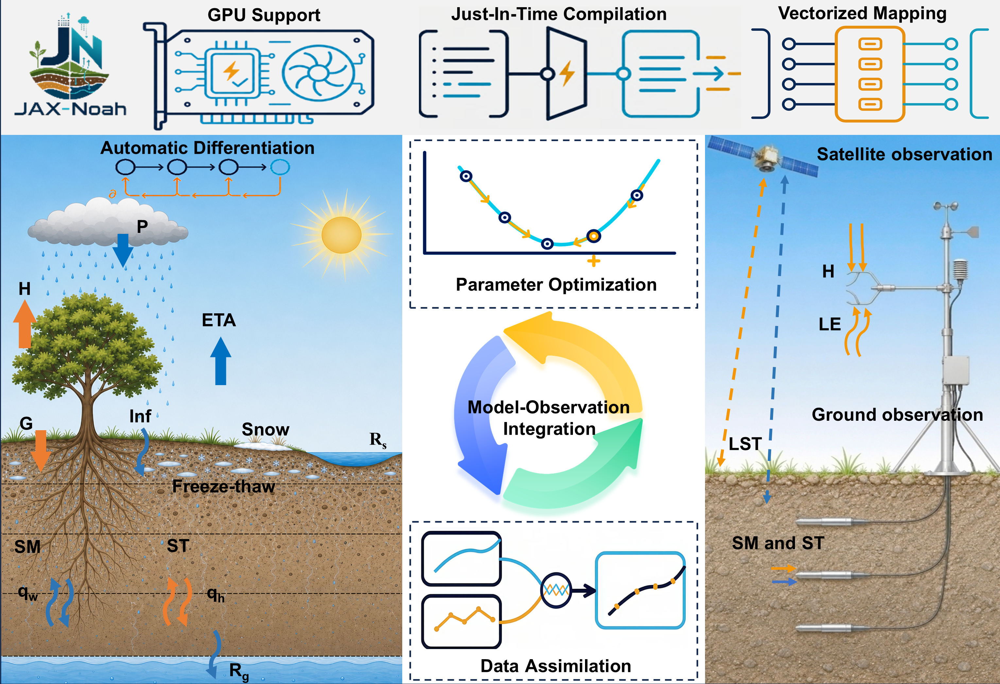

<p align="center">
	
</p>

# JAX-Noah

JAX-Noah is a differentiable land-surface modeling and data assimilation platform that integrates physical process simulation, sequential state estimation, and parameter optimization within a common JAX-based implementation.

## Model Description

JAX-Noah comprises three tightly coupled modules. The land-surface process simulation module is the forward core of the platform. It is based on the NoahPy implementation ported from PyTorch to JAX, with enhanced physical parameterizations from Noah-A incorporated into the model. The data assimilation (DA) module implements the Extended Kalman Filter (EKF) and Ensemble Kalman Filter (EnKF) for sequential state estimation using satellite or in situ observations. The parameter optimization module combines differentiable gradient-based optimization with DA-coupled Bayesian optimization to estimate selected model parameters, including soil hydraulic and thermal parameters.

Automatic differentiation provides model sensitivities and parameter gradients, while JIT compilation and vectorized execution support repeated model evaluations. Together, these capabilities establish a unified differentiable framework and may facilitate future development of variational data assimilation within JAX-Noah.



## Platform Overview

JAX-Noah unifies land-surface process simulation, sequential data assimilation, and parameter optimization in a single JAX-based computational framework. It retains the process-level equations and parameterizations of the Noah-A land surface model (LSM), while implementing differentiable model components with JAX operations to preserve physical interpretability.

- JAX computation
	- Automatic differentiation: Computes model derivatives and EKF state-transition and observation Jacobians directly from the implemented functions, without manually derived tangent-linear equations or finite-difference approximations.
	- JIT compilation: Uses JAX/XLA just-in-time compilation to accelerate repeated model evaluations.
	- Vectorization: Uses `vmap` to batch ensemble propagation, multi-start training, and parameter evaluations, including Latin hypercube sampling (LHS) workflows.
- Data assimilation
	- EKF: Calculates state-transition and observation Jacobians with automatic differentiation.
	- EnKF: Vectorizes ensemble model propagation to reduce the overhead of advancing ensemble members.
- Parameter optimization
	- S1, gradient-based: Performs differentiable parameter optimization before assimilation, combining LHS initialization, Adam, gradient clipping, and cosine-restart learning-rate schedules. Vectorized screening and multi-start training support batched evaluation.
	- S2, Bayesian: Uses Optuna with a Tree-structured Parzen Estimator (TPE) sampler for assimilation-coupled Bayesian optimization; it does not require model differentiability.
- Physical interpretability and extensibility
	- Physical interpretability: Keeps process equations, conservation relationships, and physical parameter meanings explicit.
	- Extensibility: The modular design can support future work on multivariable assimilation, spatially distributed parameter inference, uncertainty quantification, and hybrid physics–machine-learning methods.

## Current Scope and Future Directions

The current version is an initial demonstration of the broader potential of JAX-Noah. It focuses on soil moisture (SM) and soil temperature (ST) simulations over Tibetan Plateau (TP) monitoring networks, with data assimilation and parameter optimization primarily applied to SM-related processes.

Future applications may extend the framework to additional land-surface variables, including land-surface temperature, evapotranspiration, and sensible and latent heat fluxes, through multivariable data assimilation and parameter optimization.

## Requirements

- Python 3.10 or newer
- Packages listed in `requirements.txt`
- The Microsoft Visual C++ Redistributable may be needed for JAX on Windows

Create an environment and install the Python dependencies from the project directory:

```powershell
py -3.10 -m venv .venv
.\.venv\Scripts\Activate.ps1
python -m pip install --upgrade pip
python -m pip install -r requirements.txt
```

JAX's native Windows CPU support is experimental. Native Windows does not support JAX NVIDIA GPU execution; use Linux or WSL2 for NVIDIA GPU acceleration and follow the JAX installation guide for the matching CUDA setup: <https://docs.jax.dev/en/latest/installation.html>.

## Included data and parameter tables

The default experiment configurations use these input and parameter files:

- `wudaoliang-forcing_cmfd.txt`
- `wudaoliang-smap_apr01_oct31_valid.csv`
- `wudaoliang-smap_apr01_oct31_valid-CDF.csv` (available for CDF-based experiments)
- `parameter_new/SOILPARM.TBL`
- `parameter_new/VEGPARM-USGS.TBL`
- `parameter_new/VEGPARM-IGBP.TBL`

The Wudaoliang case and other Tibetan Plateau monitoring-site cases are examples for demonstrating JAX-Noah's capabilities and workflow; they do not limit the platform to these sites or applications.

## Scripts and Usage

Run the scripts below from the project directory. The project team reports that all listed workflows have been tested. Default file paths and experiment settings are defined near the top of each script; review them before running.

| Script | Purpose | Main inputs and outputs |
| --- | --- | --- |
| `generate_default_txt.py` | Runs the default Noah-A simulation. | Reads `wudaoliang-forcing_cmfd.txt` and parameter tables; writes `Noah_output_jax.txt` by default. Accepts `--forcing` and `--output` path overrides. |
| `cycling_ekf_jax_relative_error.py` | Runs soil-moisture data assimilation with the Extended Kalman Filter (EKF). | Reads the forcing file, SMAP observations, and parameter tables; writes the result configured by `OUTPUT_FILE` and an exception log. |
| `cycling_enkf_jax_relative_error.py` | Runs deterministic Ensemble Kalman Filter (EnKF) data assimilation. | Reads the forcing file, SMAP observations, and parameter tables; writes the result configured by `OUTPUT_FILE` and an exception log. |
| `optimization_minibatch_margin.py` | Trains soil parameters with differentiable mini-batch gradient optimization against SMAP observations. | Reads forcing, SMAP, and soil parameter files; writes optimized parameters, fit time series, and diagnostic plots in the project directory. |
| `optimization_lhs_multistart.py` | Screens Latin hypercube (LHS) parameter starts, trains selected starts, and can run deterministic EnKF afterward. | Inherits data and training settings from `optimization_minibatch_margin.py`; writes summaries and parameter results under `lhs_multistart_outputs/`. |
| `enkf_relative_error_optimize_optuna_soil_params_smap_mse.py` | Runs assimilation-coupled soil-parameter optimization with Optuna/TPE. | Reads forcing, SMAP, and parameter files; writes optimization results and diagnostics under `optuna_optimization_enkf_mse-wdl_soil_params_smap_20200601/` by default. Supports options including `--mode`, `--workers`, `--n_init`, and `--n_iter`. |

The Noah model implementation and its physics routines are in `Noah_jax_simple.py`, `Module_sf_noahlsm_jax_simple.py`, `Module_sfcdif_wrf_jax_simple.py`, and `Module_model_constants_jax_simple.py`; these modules are imported by the scripts above rather than run directly.

## Running

Run commands from the project directory so the data and parameter paths used by the assimilation scripts resolve correctly.

```powershell
python generate_default_txt.py
python cycling_enkf_jax_relative_error.py
python cycling_ekf_jax_relative_error.py
python optimization_minibatch_margin.py
python optimization_lhs_multistart.py
python enkf_relative_error_optimize_optuna_soil_params_smap_mse.py
```

The scripts contain experiment-specific input paths and settings near their configuration sections. Review and adjust those settings before running. Optimization and assimilation runs can be computationally intensive; JAX may initially compile functions before execution.

## Dependency notes

`requirements.txt` lists the third-party packages imported by the project, including `cmaes` for Optuna's CMA-ES sampler. It intentionally does not pin package versions; exact version pins should be added after validating a known working environment.

## Project Attribution

JAX-Noah is developed through collaboration between the Institute of Tibetan Plateau Research, Chinese Academy of Sciences (中国科学院青藏高原研究所), and the College of Hydrology and Water Resources, Hohai University (河海大学水文水资源学院).

- Project lead: Researcher Donghai Zheng (郑东海), Institute of Tibetan Plateau Research, Chinese Academy of Sciences.
- JAX-Noah coding and testing: PhD student Yu Zhang (张羽), College of Hydrology and Water Resources, Hohai University.
- Research collaboration: Postdoctoral researcher Pei Zhang (张佩) and Researcher Xin Li (李新), Institute of Tibetan Plateau Research, Chinese Academy of Sciences; Professor Haishen Lü (吕海深), College of Hydrology and Water Resources, Hohai University.

This attribution records project collaboration and contributions. The original JAX-Noah software source code in this repository is licensed under the MIT License in `LICENSE`, with copyright attributed to the collaborating institutions. The license does not cover third-party code, parameter tables, datasets, or other materials; those remain subject to their respective licenses and terms. Ownership of research outputs is subject to applicable institutional policies and collaboration agreements.

## Acknowledgements

We thank the authors and developers of NoahPy. JAX-Noah reuses and adapts portions of NoahPy's code. NoahPy-derived portions are not relicensed by this project; their original copyright notices and license terms continue to apply.
